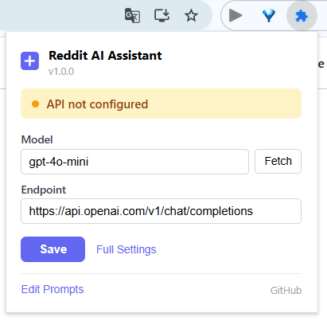

<p align="center">
  
</p>

<h1 align="center">Reddit AI Assistant</h1>

<p align="center">
  <strong>AI-powered summaries for Reddit posts and comment threads</strong>
</p>

<p align="center">
  <a href="README.md">English</a> | <a href="README.zh-CN.md">中文</a>
</p>

<p align="center">
  
  
  
  
</p>

---

## What It Does

Add one-click AI summaries to any Reddit post or comment thread. Click **Summarize Post** to extract the key point, context, and questions. Click **Summarize Comments** to see top themes, consensus, debates, and overall sentiment.

Summaries stream in real-time, rendered as clean markdown — no waiting for the full response.

**Your API key. Your provider. Zero backend.** All requests go directly from your browser to your configured endpoint. Nothing passes through our servers.



## Features

- **One-click summaries** — Summarize posts or comment threads with a single click
- **Structured output** — Posts get Key Point / Context / Questions; Comments get Themes / Consensus / Debate / Sentiment
- **Real-time streaming** — Watch the summary appear token-by-token as it's generated
- **Dark mode** — Automatically follows your Reddit theme (light or dark)
- **First-run onboarding** — Guided setup when you first install (no API key needed upfront)
- **Copy button** — One-click copy of the full summary text
- **Collapsible panel** — Click the header to collapse/expand the summary
- **BYO API key** — Works with OpenAI, Anthropic via proxy, local models (LM Studio, Ollama), or any OpenAI-compatible endpoint
- **Model auto-discovery** — Fetch available models from your endpoint with one click
- **Custom prompts** — Fully editable prompt templates with sensible defaults
- **Chrome + Firefox** — Supports Chrome/Edge (Manifest V3); Firefox (Manifest V2) is available but not yet fully tested

<!-- Screenshots: comment summary, dark mode, popup, onboarding -->
<!-- Add your screenshots to a screenshots/ directory -->

## Installation

### Chrome Web Store

_Coming soon_

### Install from Source

```bash
git clone https://github.com/BlingDan/Reddit-AI-Assistant.git
cd reddit-ai-assistant
npm install
npm run build
```

Then load in Chrome:

1. Open `chrome://extensions`
2. Enable **Developer mode**
3. Click **Load unpacked**
4. Select the `.output/chrome-mv3` directory

### Firefox (Experimental)

> **Note:** Firefox support has not been fully tested. It may work, but expect potential issues. Feedback and PRs welcome!

```bash
npm run build:firefox
```

Load in Firefox:

1. Open `about:debugging#/runtime/this-firefox`
2. Click **Load Temporary Add-on**
3. Select `.output/firefox-mv2/manifest.json`

## Configuration

### Quick Setup (Popup)

Click the extension icon in your toolbar to open the status dashboard:

- **Model** — Select from auto-discovered models or type manually
- **Endpoint** — Your API endpoint URL
- **Save** — Stores settings locally

### Full Settings (Options Page)

Right-click the extension icon → **Options**, or click **Full Settings** from the popup:

| Setting        | Default                                      | Description                                 |
| -------------- | -------------------------------------------- | ------------------------------------------- |
| API Endpoint   | `https://api.openai.com/v1/chat/completions` | Any OpenAI-compatible endpoint              |
| API Key        | _(empty)_                                    | Stored locally, never sent to third parties |
| Model          | `gpt-4o-mini`                                | Model name to use                           |
| Post Prompt    | _(built-in)_                                 | Customizable prompt for post summaries      |
| Comment Prompt | _(built-in)_                                 | Customizable prompt for comment summaries   |

Use `{content}` as a placeholder for extracted text in custom prompts.

## Privacy & Permissions

**Zero data collection.** No analytics, no tracking, no telemetry.

- Your API key is stored locally in `chrome.storage.local`
- All API calls go directly from your browser to your configured endpoint
- No data passes through any third-party server

| Permission           | Why                                                 |
| -------------------- | --------------------------------------------------- |
| `storage`            | Save API settings and prompt templates locally      |
| `activeTab`          | Access current Reddit tab content for summarization |
| `*://*.reddit.com/*` | Content script injection on Reddit pages only       |

No broad host permissions. No remote code.

## Development

### Quick Start

```bash
npm install
npx wxt          # Chrome dev mode
npx wxt --browser firefox  # Firefox dev mode
```

WXT will print a URL to load the unpacked extension in your browser with hot reload.

### Architecture

```
src/
├── entrypoints/          # WXT entry points
│   ├── background.ts     # Service worker (message routing, API calls)
│   ├── content.ts        # Content script (injected into reddit.com)
│   ├── popup/            # Status dashboard (Vue 3)
│   └── options/          # Settings page (Vue 3 SPA)
├── background/           # Background service worker logic
│   ├── router.ts         # Typed message router
│   ├── ai-client.ts      # Streaming OpenAI-compatible client
│   ├── prompt-builder.ts # Template + system prompt builder
│   └── config.ts         # chrome.storage settings manager
├── content/              # Content script logic
│   ├── dom-adapter.ts    # Reddit DOM selector abstraction
│   └── ui-injector.ts    # Buttons, panel, onboarding, dark mode
├── options/views/        # Settings page components
│   ├── ApiSettings.vue
│   ├── PromptTemplates.vue
│   └── About.vue
└── shared/               # Shared types and constants
    ├── types.ts
    └── constants.ts
```

**Three layers:**

1. **Content Script** — Injected into reddit.com. Detects posts, injects buttons, extracts content, renders streaming responses. Handles dark mode and onboarding.

2. **Background Service Worker** — Handles all API communication. Routes messages, builds prompts, streams responses via `chrome.runtime.Port`.

3. **Options + Popup** — Vue 3 SPAs. Popup is a status dashboard (connection state, quick settings). Options page has full settings (API, prompts, about).

### Adding New Features

```ts
// 1. Define messages in src/features/your-feature/messages.ts
// 2. Register a handler in entrypoints/background.ts:
registerHandler('YOUR_TYPE', async (request, sendResponse) => { ... });
// 3. Add UI triggers in content/ui-injector.ts
```

## Inspiration

This project was inspired by [linuxdo-scripts](https://github.com/anghunk/linuxdo-scripts), a feature-rich browser extension designed to enhance the LinuxDo forum experience. It integrates a wide range of practical features — from basic UI optimizations to advanced AI-powered assistance — making forum browsing and interaction smoother and more efficient.

## License

[MIT](LICENSE)
